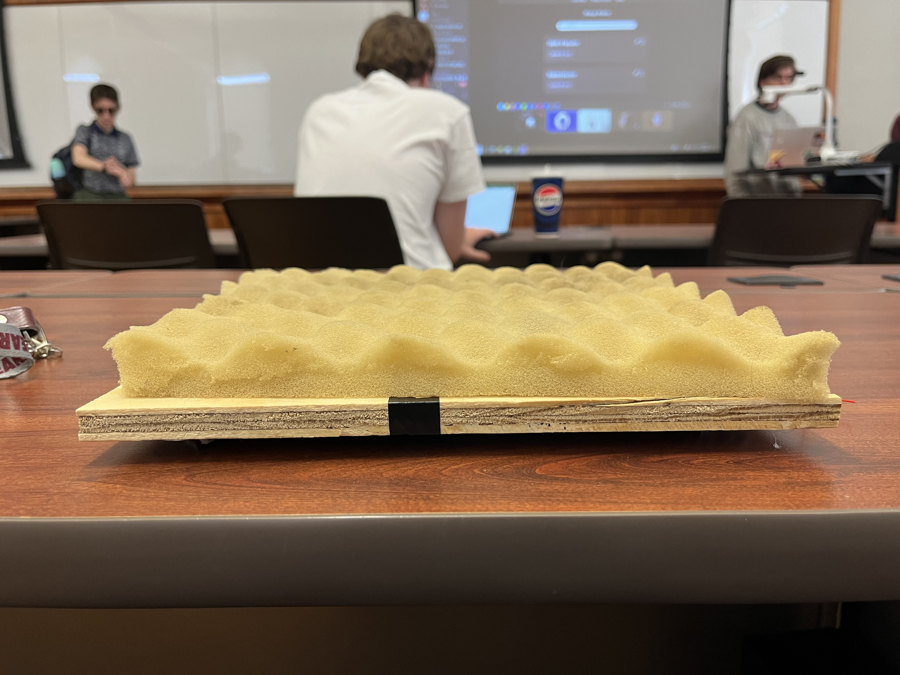
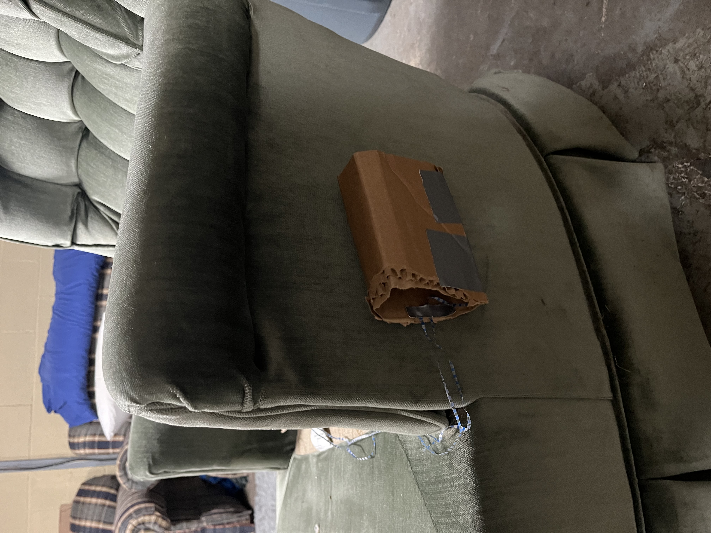
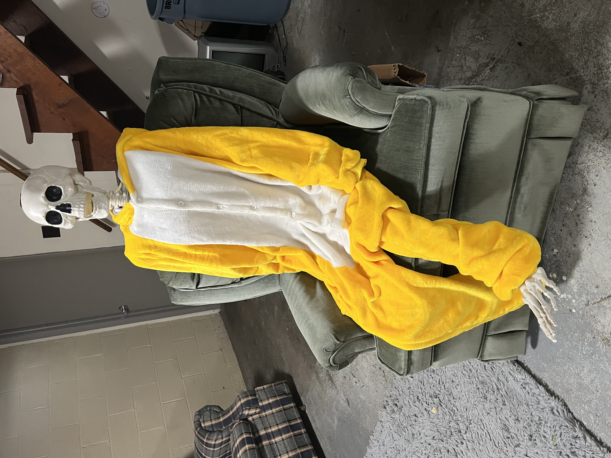

<p align="center">
  
</p>

<h1 align="center">SeatSense</h1>

<p align="center">
  A passive weight-sensor patient monitoring system built for healthcare environments.<br/>
  Developed in collaboration with <strong>St. Luke's University Health Network (SLUHN)</strong>.
</p>

<p align="center">
  
  
  
  
  
  
</p>

---

## Overview

SeatSense monitors whether a patient is seated using a pressure-sensitive pad placed under the chair cushion. It tracks seated duration, fires configurable alerts when thresholds are exceeded, and notifies caregivers when patients miss scheduled check-in windows — all without requiring any action from the patient.

The system was built by a three-person student team and handed off to **St. Luke's University Health Network in May 2024** for evaluation and potential clinical implementation.

---

## The Problem

Extended sedentary periods are a clinical concern in patient care, particularly for patients recovering from procedures like total hip arthroplasty. Caregivers need a low-friction way to track seated duration and check-in compliance without actively monitoring patients or requiring patient interaction with the system. SeatSense solves this with a completely passive sensor layer.

---

## Features

- **Passive occupancy detection** — weight sensor embedded under the chair cushion, no patient interaction required
- **Configurable thresholds** — caregivers set per-patient seated duration limits and check-in windows
- **Real-time alerts** — notifications triggered on threshold breach or missed check-in
- **False-positive suppression** — brief absences (restroom breaks) factored into alert logic
- **Seated time logging** — full time log of patient seated activity
- **Role-based access** — separate caregiver and root admin views
- **Client management** — admin can register patients and assign caregivers
- **Email / SMS / haptic alerts** — configurable notification delivery per patient
- **Password reset** — email-based reset via Nodemailer

---

## Tech Stack

| Layer | Technology |
|---|---|
| Frontend | React 18, Material UI v5, React Router v6, Axios |
| Backend | Node.js, Express |
| Database | MySQL, Sequelize ORM |
| Auth | JWT, bcrypt |
| Notifications | Nodemailer (SMTP) |
| Hardware | Raspberry Pi, weight/pressure sensors (4-point array, MX connector) |
| Deployment | SLUHN-hosted (decommissioned May 2024) |

---

## Hardware

The physical sensor assembly consists of a 4-point pressure sensor array embedded in a foam comfort pad, mounted on a plywood base to sit under a chair cushion. Sensors connect to a central MX connector, which routes to the Raspberry Pi for data processing and transmission to the backend.

<p align="center">
  
  
</p>

<p align="center">
  
  
</p>

*Left: sensor pad assembly (foam cushion over plywood base). Right: 4-point sensor layout with MX connector (drawn on cardboard during prototyping). Bottom left: Raspberry Pi module installed in chair frame. Bottom right: prototype testing with a weighted test subject.*

---

## System Architecture

```
Raspberry Pi + 4-point Weight Sensor Array
        │
        │ HTTP POST (sensor readings)
        ▼
  Node.js / Express REST API
        │
        ├── MySQL via Sequelize ORM
        │     ├── Users / Caregivers
        │     ├── Clients (Patients)
        │     ├── Sensor Readings
        │     └── Notifications
        │
        ├── Nodemailer (email/SMS alerts)
        │
        └── React 18 Frontend (MUI v5)
              ├── Login / Register / Password Reset
              ├── Caregiver Dashboard
              ├── Client (Patient) View
              ├── Notifications Page
              ├── Profile Page
              └── Root Admin Dashboard
```

---

## Application Screens

### Login
Two-column layout: SeatSense logo panel on the left, sign-in form on the right. Includes email/password fields, error feedback, forgot password, and sign-up links.

### Dashboard
Caregiver landing page showing the current patient's status at a glance:
- **Current Status** — Seated / Not seated
- **Time Seated** — Live counter (e.g. 2hrs 15min 23sec)
- **Last Alert** — Timestamp of most recent notification
- **Active Alerts** — Current alert count

### Notifications
Chronological alert log with per-notification actions: Mark as Read, Dismiss, Snooze. Alert types include seated duration reminders and stand-up events.

### Client
Per-patient detail view showing:
- Name, age, sex, gender, medical condition
- **Alarm threshold** — configurable duration before alert fires (e.g. 1hr 30min)
- **Alert type** — Phone, SMS, Haptic
- **Snooze duration** — configurable window (e.g. 10min)
- **Notification setting** — Active / Do Not Disturb
- Assigned caregiver contact info

### Profile
Caregiver profile with edit capability.

### Root Admin Dashboard
Admin-only view for managing caregiver accounts and patient assignments.

---

## Project Diagrams

| Diagram | Link |
|---|---|
| Context Diagram | [View](https://docs.google.com/spreadsheets/d/1qV1WKEFyU27Uk_XOlJQLWVyRiMQ0DUOngXsA47FOCYI/edit?usp=drive_link) |
| Use Case Diagram | [View](https://docs.google.com/document/d/11HFlz7UyTxVYJmE6q1iyrR8V4ipBEa2ipqIvEYcrsHQ/edit?usp=drive_link) |
| Wireframe | [View](https://docs.google.com/document/d/1z0uEi7CwZw6xhUmhtxexyhhBEGdNLQePkJ5ze49SKhE/edit?usp=drive_link) |

**Actors identified in system design:**

*Patient* — Has sensor respond to appropriate pressure, comfortable experience, false-alert suppression, and friendly reminders to get up.

*Caregiver* — Receives notifications of patient activity, sets routine times, reviews accurate sensor data, and accesses seated time logs.

*Sensor* — Detects appropriate weight, sends data to SeatSense software, records seated duration.

---

## Repository Structure

```
SeatSense/
├── frontend/               # React 18 application
│   └── src/
│       └── components/
│           ├── LoginPage/
│           ├── DashboardPage/
│           ├── ClientPage/
│           ├── NotificationsPage/
│           ├── ProfilePage/
│           ├── PasswordPage/
│           ├── RegisterPage/
│           └── RootDashPage/
├── backend/                # Node.js / Express API
│   ├── routes/
│   │   ├── Login.js
│   │   ├── SensorData.js
│   │   ├── Notification.js
│   │   ├── Client.js
│   │   ├── User.js
│   │   ├── PhoneCall.js
│   │   └── ...
│   └── server.js
└── README.md
```

---

## Local Development

### Prerequisites

- Node.js v18+
- MySQL database
- Raspberry Pi with weight sensors (optional — backend accepts HTTP sensor data directly)

### Frontend

```bash
cd frontend
npm install
npm start
# Runs at http://localhost:3000
```

> Authentication requires a running backend. To browse the UI without a backend, set fake session values in the browser console: `sessionStorage.setItem('token', 'fake-token')` then navigate directly to `/dashboard`.

### Backend

```bash
cd backend
npm install
```

Create `backend/.env`:

```env
DB_HOST=localhost
DB_USER=your_db_user
DB_PASSWORD=your_db_password
DB_NAME=seatsense
JWT_SECRET=your_jwt_secret
REACT_APP_BACKEND_URL=http://localhost:5000
EMAIL_USER=your_email@example.com
EMAIL_PASS=your_email_password
```

```bash
npm run dev
```

---

## Team

| Name | Role |
|---|---|
| Nathan Shutter | Frontend development, project architecture |
| Brogan [Last] | Hardware integration, sensor interface |
| Jesse [Last] | Backend development, database design |

Built as a collaborative capstone-style project in partnership with **St. Luke's University Health Network (SLUHN)**.

---

## Project Status

Completed and handed off to SLUHN in **May 2024** for evaluation and potential clinical deployment. The production deployment at `seatsense.sluhncauldron.org` is no longer active. This repository represents the full codebase as delivered.
